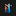
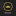

# Media Log (MLOG)

MLOG is my monorepo for tracking articles, books, podcasts, movies, and shows along with corresponding notes.

## Legend

[](https://audible.com) Audible

[](https://canonplus.com) Canon+

[](https://christianaudio.com) Christian Audio

[](https://christkirk.com) Christ Kirk

[](https://crosspolitic.com) Cross Politic

[](https://disneyplus.com) Disney+

[](https://everand.com) Everand

[](https://drive.google.com) Google Drive

[](https://hoopladigital.com) Hoopla

[](https://hulu.com) Hulu

[](https://jellyfin.org) Jellyfin

[](https://max.com) Max

[](https://primevideo.com) Prime Video

[](https://remnantrva.com) Remnant

[](https://scribd.com) Scribd

[](https://spotify.com) Plex

[](https://archive.org) Archive (Wayback Machine)

[](https://youtube.com) YouTube

## Structure

```text
mlog/
├── articles/
│   ├── Article-Title/
│   │   ├── summary.md
│   │   ├── notes.md
│   │   └── thoughts.md
├── books/
│   ├── Book-Title/
│   │   ├── summary.md
│   │   ├── notes.md
│   │   └── thoughts.md
├── podcasts/
│   ├── Podcast-Title/
│   │   ├── Episode_1.md
│   │   ├── Episode_2.md
│   │   └── summary.md
├── movies/
│   ├── Movie-Title.md
├── shows/
│   ├── Show-Title/
│   │   ├── Season-1/
│   │   │   ├── Episode-1.md
│   │   │   └── Episode-2.md
│   │   └── summary.md
└── README.md
```

## Table of Contents

- [articles](./articles)
- [books](./books)
- [podcasts](./podcasts)
- [movies](./movies)
- [shows](./shows)
